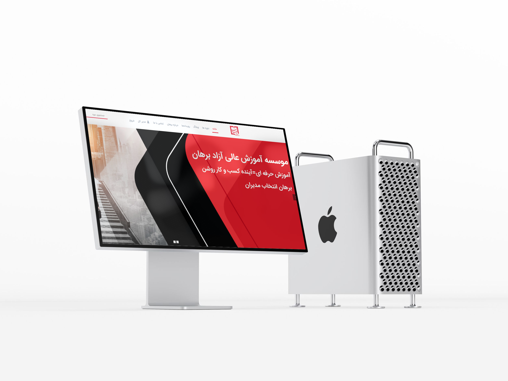

# Very short description of the package

[](https://packagist.org/packages/dpsoft/mehr4-theme-danesh)
[](https://packagist.org/packages/dpsoft/mehr4-theme-danesh)

BeTheme-(hr)




## Installation

You can install the package via composer:

```bash
composer require dpsoft/mehr4-theme-danesh
```

## Usage

**راهنمای  مدیریت سایت **
____
## تغییر تصاویر

### تغییر لوگو

جهت تغییر لوگوی سایت ،ابتدا وارد سامانه می شویم و در سامانه از طریق منوی سمت راست ،در قسمت مدیریت فایل وارد پوشه theme شوید و فایل مربوط به لوگو را در این قسمت اپلود کنید.اسم فایل باید logo.png باشد و سایز عکس 90*136 باشد
___
### تغییر اسلایدر


جهت تغییر اسلایدر در همین مسیر بالا تصاویر با نام و سایز های زیر را ایجاد می کنیم


نام تصویر شماره ۱ : slider1.jpg
سایز تصویر :880*1920


نام تصویر شماره 2 :     slider2.png

سایز تصویر :726*1519


نام تصویر شماره 3 : slider3.jpg

سایز تصویر :629*1920

___
### سایز تصاویر

دوره ها: 250*375
___

### تغییر آیکن های زیر اسلایدر در صفحه اصلی
جهت تغییر عکس در همین مسیر بالا فایل مربوط یه اسلایدر که نام آن ها  icon4.png  icon3.png  icon2.png  icon1.png باید باشد را آپلود می کنیم.سایز تصویر باید 100*200 باشد
___
### تغییر عکس درباره ما در صفحه اصلی 
   سایز:645*700  
  نام عکس:about-home.png
  ___
### تغییر عکس دپارتمان ها  در صفحه اصلی 
  تغییر عکس از طریق سامانه مهر امکان پذیر می باشد . سایز:143*324 
  ___
### تغییر عکس پس زمینه دوره ها در صفحه اصلی 
   سایز:627*1850  
  نام عکس:course-bg-home.png
___
### تغییر عکس آخرین مقالات در صفحه اصلی 
   سایز:623*780  
  نام عکس:blog-home.png
___
### تغییر عکس بخش مشاوره رایگان 
عکس اول:    
   سایز:606*780  
  نام عکس:contact-home1.png
    عکس دوم:
     سایز:469*780  
    نام عکس:contact-home2.png
   
___
### تغییر  تصویر  همکاران استراتژیک برهان  در صفحه اول 
   سایز:75*145  
  نام عکس:customer1.png الی customer12.png
___

### تغییر  تصویر لوگو در فوتر 
  نام عکس:logo-footer.png
  
130*30
 ___
### تغییر  هدر تصویر صفحه بلاگ
   سایز:900*1920  
  نام عکس:blog-page.png
___
### تغییر  هدر تصویر پست 
   سایز:900*1920  
  نام عکس:post.jpg
___
### تغییر  هدر تصویر صفحه  درباره ما
   سایز:900*1920  
     نام عکس:header-about.png
___
### تغییر  هدر تصویر صفحه  تماس با ما
   سایز:900*1920  
  نام عکس:header-contact.png
___
### تغییر  هدر تصویر صفحه  بلاگ
   سایز:900*1920  
  نام عکس:blog-page.png
___
### تغییر  هدر تصویر صفحات    
   سایز:900*1920  
  نام عکس:header-page.png
___
### تغییر  هدر تصویر صفحه دوره ها   
   سایز:900*1920  
  نام عکسcourse-page.png
___
### تغییر عکس تماس با ما در صفحه تماس با ما
   سایز:635*635  
  نام عکس:contact.jpg
___
### تغییر صفحه سوالات متداول

وارد سامانه میشویم و وارد منوی سمت راست به نام صفحات می شویم.
صفحه ای به نام پرسش و پاسخ وجود دارد که با تغییر متن های این صفحه، صفحه سوالات متداول هم تغییر می کند.
می توان در قسمت سئو برای این صفحه ، متا تگ و دیسکریپشن جدا تعریف کرد.
___
## تغییر شعار،عناوین اسلایدر ،درباره ما  
جهت تغییر متن های سایت ، بعد از وارد شدن در سامانه،در منوی سمت راست قسمت تنظیمات را زده و تمام متن های سایت مانند شعار،درباره ما،متن های روی اسلایدر،متن های صفحه درباره ما،آدرس،شماره تلفن،لینک شبکه های اجتماعی و .... را تغییر دهید.
همچنین تغییر آدرس در گوگل  و توضیح کوتاه برای SEO در این قسمت امکان پذیر است.	

___
### تغییر شعارهای اسلایدر 
جهت تغییر در همین مسیر بالا متغییرهای مربوط به نام های متن اول اسلایدر و متن دوم اسلایدر  را تغییر دهید.
___
### تغییرعنوان آیکن های صفحه اصلی زیر اسلایدر  
جهت تغییر در همین مسیر بالا متغییرهای مربوط به نام های متن آیکن اول صفحه اصلی تا آیکن چهارم صفحه اصلی را تغییر دهید
.
جهت تغییر توضیحات هر مورد متن آیکن اول زیر اسلایدر الی متن آیکن چهارم را تغییر دهید.
___
### تغییرمتن آیکن درباره ما در صفحه اصلی  
جهت تغییر در همین مسیر بالا متغییرهای مربوط به نام  درباره ما-صفحه اصلی
 را تغییر دهید.
___
### تغییرمتن توضیحی دپارتمان ها در صفحه اصلی  
جهت تغییر در همین مسیر بالا متغییرهای مربوط به نام های متن آیکن اول صفحه اصلی تا آیکن چهارم صفحه اصلی را تغییر دهید.

___
###  و تغییر نام  دپارتمان اول و دوم در صفحه اصلی  
 
 از طریق گزینه های نام دوره اول در ص اول
 و نام دوره دوم در ص دوم
 و همچنین گزینه تعداد دوره و لینک دوره  اقدام فرمایید
___

### تغییرمتن  ۴ آیکن شمارنده در صفحه اصلی  
جهت تغییر در همین مسیر بالا متغییرهای مربوط به نام های عنوان شمارنده شماره ۱ الی ۴ را تغییر دهید.
جهت تغییر تصاویر این بخش تصاویر به نام icon5.png icon6.png icon7.png icon8.png 
با سایز 
100*57 
قابل تغییر است.
___
### تغییرمتن تبلیغاتی در صفحه اصلی  
جهت تغییر در همین مسیر بالا متغییرهای مربوط به متن تبلیغاتی صفحه اول را تغییر دهید.
___
### تغییرمتن درباره ما در بخش فوتر صفحه اصلی   
جهت تغییر در همین مسیر بالا متغییرهای مربوط به متن درباره ما فوتر را تغییر دهید.
___
### تغییرمتن درباره ما در صفحه درباره ما   
متون موجود در صفحه درباره ما به صورت تنظیمات و با نام های زیر تعریف شده اند.
صفحه درباره ما شامل سه متن و یک لیست می باشد:
متن اول با نام
site.about
می باشد.
لیست حاوی شش مورد با نام های
about.item1
و
about.item2
و
about.item3
و
about.item4
و
about.item5
و
about.item6
می باشد.
سپس متن دوم و سوم با نام های
site.about2 
و
site.about3
می باشند.
___
### تغییرعنوان تیم ما و عنوان شغلی اعضا تیم در صفحه درباره ما   
جهت تغییر در همین مسیر بالا متغییرهای اعضای تیم ۱ تا ۴ و شغل اعضای تیم ۱ تا ۴  را تغییر دهید
.
جهت فعال کردن بخش تیم ما در تنظیمات گزینه فعال کردن بخش تیم ما را مقدار دهی کنید.
___
### تغییر عنوان مربوط به محتوای آموزشی
جهت تغییر در همین مسیر بالا ، متغیر عنوان محتوای آموزشی 1 تا 4 را تغییر دهید
___
### اضافه کردن مشخصات دوره مانند کد دوره-گواهینامه-ساعت آموزشی-طول دوره
و
...
جهت اضافه کردن این موارد به هر دو در قسمت متای مربوط به دوره ها باید متاهایی به نام های زیر ایجاد کنید:
کد دوره=code
گواهینامه=certificate
ساعت آموزشی=hour-time
طول دوره=time-course
سطح مهارت=level
تعداد سر فصل ها=sectioncount
قیمت تخفیف دوره:discount

   همچنین برای اضافه کردن ظرفیت باقی مانده و تعداد افراد دوره , گزینه های مربوط 
   به جزییات  هر دوره را تغییر دهید. 
___
###تغییر منو

صفحه آگهی استخدام و اساتید از طریق صفحات در سامانه قابل تغییر هستند.

سه تگ خلاصه مقالات-ویدیو و پادکست و خلاصه کتاب ایجاد شده است
 
.با قرار دادن هر کدام از این تگ ها در مطالب   مطلب مورد نظر به زیر منوی مربوط به خودش انتصاب می یاید.  
___
### فعال بودن و عدم فعال بودن بخش های مختلف صفحه اول
جهت غیر فعال نمودن در قسمت تنظیمات
 مقدار 
true 
را به 
false
تغییر دهید.
این تنظیمات شامل
فعال بودن قسمت اسلایدر و فعال بودن قسمت چرا ما وفعال بودن قسمت درباره ما وفعال بودن قسمت دپارتمان ها و سایر قسمت های صفحه اصلی می باشد.

___
## اولویت بندی دوره ها در صفحه اصلی
جهت اولویت بندی نمایش دوره ها متای
priority
را به دوره اضافه کرده و با انتصاب عدد به این متا اولویت نمایش آن را مشخص کنید


### Security

If you discover any security related issues, please email info@dpsoft.ir instead of using the issue tracker.

## Credits

- [zahrayavari](http://mygitlab.ir/dpsoft)

## License

The Apache License 2. Please see [License File](LICENSE.md) for more information.

